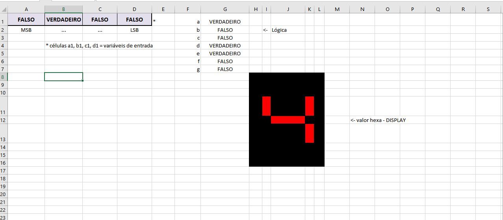

Excel Seven Segment Display
===========================

This project models the hardware logic of a [BCD](https://en.wikipedia.org/wiki/Binary-coded_decimal)-to-[seven-segment display](https://en.wikipedia.org/wiki/Seven-segment_display) decoder IC (such as the 7448) using MS Excel formulas and expressions.

By playing with the binary values of the input cells in the spreadsheet, the display image changes accordingly. Here is what it looks like on the surface:



Personal historical value
-------------------------

I finished this little project in early February 2011. Although it does not have much to show, it remains very dear to me because I consider it to be my first *programming-like* project ever 🎉, a mark on my personal history of the very beginning of my activity as a *computer programmer* (to use a now very *retro* term). That is precisely the kind of sh*t I did back then that managed to got me in trouble for almost a decade now.

The docs
--------

Here is a compilation of some of the contents of the companion *.txt files:

### Function table

Here, column indexes point to the display pin (from "a" to "g"); row indexes indicate  the character to be formed in the display; cells, whether empty or not, indicate the state of the pin; cell values themselves contain the BCD (Binary-Coded Decimal) input.

```

         ::: Representação de valores hexa em display de 7 segmentos :::


  +----------+----------+----------+----------+----------+----------+----------+
X |  < a >   |  < b >   |  < c >   |  < d >   |  < e >   |  < f >   |  < g >   |
  +----------+----------+----------+----------+----------+----------+----------+
0 |          |          |          |          |          |          | A'B'C'D' |
  +----------+----------+----------+----------+----------+----------+----------+
1 | A'B'C'D  |          |          | A'B'C'D  | A'B'C'D  | A'B'C'D  | A'B'C'D  |
  +----------+----------+----------+----------+----------+----------+----------+
2 |          |          | A'B'C D' |          |          | A'B'C D' |          |
  +----------+----------+----------+----------+----------+----------+----------+
3 |          |          |          |          | A'B'C D  | A'B'C D  |          |
  +----------+----------+----------+----------+----------+----------+----------+
4 | A'B C'D' |          |          | A'B C'D' | A'B C'D' |          |          |
  +----------+----------+----------+----------+----------+----------+----------+
5 |          | A'B C'D  |          |          | A'B C'D  |          |          |
  +----------+----------+----------+----------+----------+----------+----------+
6 |          | A'B C D' |          |          |          |          |          |
  +----------+----------+----------+----------+----------+----------+----------+
7 |          |          |          | A'B C D  | A'B C D  | A'B C D  | A'B C D  |
  +----------+----------+----------+----------+----------+----------+----------+
8 |          |          |          |          |          |          |          |
  +----------+----------+----------+----------+----------+----------+----------+
9 |          |          |          |          | A B'C'D  |          |          |
  +----------+----------+----------+----------+----------+----------+----------+
A |          |          |          | A B'C D' |          |          |          |
  +----------+----------+----------+----------+----------+----------+----------+
B | A B'C D  | A B'C D  |          |          |          |          |          |
  +----------+----------+----------+----------+----------+----------+----------+
C | A B C'D' | A B C'D' | A B C'D' |          |          | A B C'D' |          |
  +----------+----------+----------+----------+----------+----------+----------+
D | A B C'D  |          |          |          |          | A B C'D  |          |
  +----------+----------+----------+----------+----------+----------+----------+
E |          | A B C D' | A B C D' |          |          |          |          |
  +----------+----------+----------+----------+----------+----------+----------+
F |          | A B C D  | A B C D  | A B C D  |          |          |          |
  +----------+----------+----------+----------+----------+----------+----------+

  -- "< a >", "< b >", "< c >"..."< g >" = terminais do display
  -- "A", "B", "C" e "D" = bits de entrada
  -- Células vazias são ativas em nível alto
```

### [Karnaugh maps](https://en.wikipedia.org/wiki/Karnaugh_map)

```

                ::: Simplificação das equações de saída :::


        C'D' | C'D  | C D  | C D'    ------------- terminal a --------------
      +------+------+------+------+
 A'B' |  0   |  1   |  0   |  0   |  - par(1): A'B C'D';A B C'D' = B C'D'
 -----+------+------+------+------+  - par(2): A B C'D';A B C'D  = A B C'
 A'B  |  1   |  0   |  0   |  0   |  - iso(1): A'B'C'D           = A'B'C'D
 -----+------+------+------+------+  - iso(2): A B'C D           = A B'C D
 A B  |  1   |  1   |  0   |  0   |
 -----+------+------+------+------+
 A B' |  0   |  0   |  1   |  0   |
      +------+------+------+------+  a = B C'D'+ A B C'+ A'B'C'D + A B'C D

        C'D' | C'D  | C D  | C D'    ------------- terminal b --------------
      +------+------+------+------+
 A'B' |  0   |  0   |  0   |  0   |  - par(1): A B C'D';A B C D' = A B D'
 -----+------+------+------+------+  - par(2): A B C D ;A B'C D  = A C D
 A'B  |  0   |  1   |  0   |  1   |  - par(3): A'B C D';A B C D' = B C D'
 -----+------+------+------+------+  - iso(1): A'B C'D           = A'B C'D
 A B  |  1   |  0   |  1   |  1   |
 -----+------+------+------+------+
 A B' |  0   |  0   |  1   |  0   |
      +------+------+------+------+  b = A B D'+ A C D + B C D'+ A'B C'D

        C'D' | C'D  | C D  | C D'    ------------- terminal c --------------
      +------+------+------+------+
 A'B' |  0   |  0   |  0   |  1   |  - par(1): A B C'D';A B C D' = A B D'
 -----+------+------+------+------+  - par(2): A B C D ;A B C D' = A B C
 A'B  |  0   |  0   |  0   |  0   |  - iso(1): A'B'C D'          = A'B'C D'
 -----+------+------+------+------+
 A B  |  1   |  0   |  1   |  1   |
 -----+------+------+------+------+
 A B' |  0   |  0   |  0   |  0   |
      +------+------+------+------+  c = A B D'+ A B C + A'B'C D'

        C'D' | C'D  | C D  | C D'    ------------- terminal d --------------
      +------+------+------+------+  
 A'B' |  0   |  1   |  0   |  0   |  - par(1): A'B C D ;A B C D = B C D
 -----+------+------+------+------+  - iso(1): A'B C'D'         = A'B C'D'
 A'B  |  1   |  0   |  1   |  0   |  - iso(2): A'B'C'D          = A'B'C'D
 -----+------+------+------+------+  - iso(3): A B'C D'         = A B'C D'
 A B  |  0   |  0   |  1   |  0   |
 -----+------+------+------+------+
 A B' |  0   |  0   |  0   |  1   |
      +------+------+------+------+  d = B C D + A'B C'D'+ A'B'C'D + A B'C D'

        C'D' | C'D  | C D  | C D'    ------------- terminal e --------------
      +------+------+------+------+
 A'B' |  0   |  1   |  1   |  0   |  - qrt(1): A'B'C'D ;A'B'C D;
 -----+------+------+------+------+            A'B C'D ;A'B C D = A'D
 A'B  |  1   |  1   |  1   |  0   |  - par(1): A'B C'D';A'B C'D = A'B C'
 -----+------+------+------+------+  - par(2): A'B'C'D ;A B'C'D = B'C'D
 A B  |  0   |  0   |  0   |  0   |
 -----+------+------+------+------+
 A B' |  0   |  1   |  0   |  0   |
      +------+------+------+------+  e = A'D + A'B C'+ B'C'D

        C'D' | C'D  | C D  | C D'    ------------- terminal f --------------
      +------+------+------+------+
 A'B' |  0   |  1   |  1   |  1   |  - par(1): A'B'C'D ;A'B'C D = A'B'D
 -----+------+------+------+------+  - par(2): A'B'C D ;A'B'C D'= A'B'C
 A'B  |  0   |  0   |  1   |  0   |  - par(3): A'B'C D ;A'B C D = A'C D
 -----+------+------+------+------+  - par(4): A B C'D';A B C'D = A B C'
 A B  |  1   |  1   |  0   |  0   |
 -----+------+------+------+------+
 A B' |  0   |  0   |  0   |  0   |
      +------+------+------+------+  f = A'B'D + A'B'C + A'C D + A B C'

        C'D' | C'D  | C D  | C D'    ------------- terminal g --------------
      +------+------+------+------+
 A'B' |  1   |  1   |  0   |  0   |  - par(1): A'B'C'D';A'B'C'D = A'B'C'
 -----+------+------+------+------+  - iso(1): A'B C D          = A'B C D
 A'B  |  0   |  0   |  1   |  0   |
 -----+------+------+------+------+
 A B  |  0   |  0   |  0   |  0   |
 -----+------+------+------+------+
 A B' |  0   |  0   |  0   |  0   |
      +------+------+------+------+  g = A'B'C'+ A'B C D

```

### MS Excel boolean logic expressions

```

                     ::: A lógica no Excel :::


 -> atribuições:

	    célula A1 <= MSB
	    célula B1 <= ...
	    célula C1 <= ...
	    célula D1 <= LSB

 -> representação das equações de saída:
 
 ------> saída a < a = B C'D'+ A B C'+ A'B'C'D + A B'C D  >:

         =OU(E(B1;NÃO(C1);NÃO(D1));E(A1;B1;NÃO(C1));E(NÃO(A1);
          NÃO(B1);NÃO(C1);D1);E(A1;NÃO(B1);C1;D1))

 ------> saída b < b = A B D'+ A C D + B C D'+ A'B C'D  >:

         =OU(E(NÃO(A1);B1;NÃO(C1);D1);E(A1;B1;NÃO(D1));
          E(A1;C1;D1);E(B1;C1;NÃO(D1)))

 ------> saída c < c = A B D'+ A B C + A'B'C D' >:

         =OU(E(NÃO(A1);NÃO(B1);C1;NÃO(D1));E(A1;B1;C1);
          E(A1;B1;NÃO(D1)))

 ------> saída d < d = B C D + A'B C'D'+ A'B'C'D + A B'C D' >:

         =OU(E(NÃO(A1);B1;NÃO(C1);NÃO(D1));E(NÃO(A1);NÃO(B1);
          NÃO(C1);D1);E(B1;C1;D1);E(A1;NÃO(B1);C1;NÃO(D1)))

 ------> saída e < e = A'D + A'B C'+ B'C'D >:

         =OU(E(NÃO(A1);D1);E(NÃO(B1);NÃO(C1);D1);
          E(NÃO(A1);B1;NÃO(C1)))

 ------> saída f < f = A'B'D + A'B'C + A'C D + A B C' >:

         =OU(E(A1;B1;NÃO(C1));E(NÃO(A1);NÃO(B1);D1);
          E(NÃO(A1);C1;D1);E(NÃO(A1);NÃO(B1);C1))

 ------> saída g < g = A'B'C'+ A'B C D >:

         =OU(E(NÃO(A1);NÃO(B1);NÃO(C1));E(NÃO(A1);B1;C1;D1))

```
